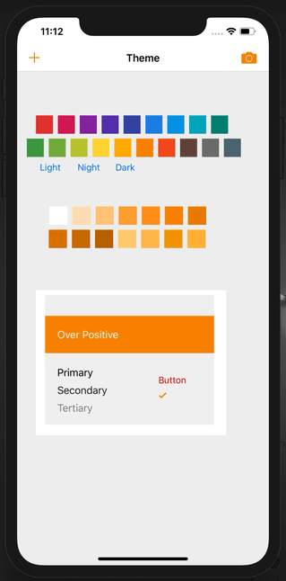

# SwiftyThemeKit

[](https://github.com/Carthage/Carthage)
[](https://img.shields.io/cocoapods/v/SwiftyThemeKit.svg)


自动产生配色方案，一键切换夜间模式。


配色是参考的 [colorless.app](https://colorless.app/)


## Shot





## Usage


```swift
// 设置主题色和样式
// color： 主题色
// style：light、dark、night
ThemeManager.shared.changeTheme(with: color, style: style)

// bind
navigationController?.navigationBar.tk.barTintColor = \Theme.background.bar
label.tk.textColor = \Theme.text.primary
view.tk.backgroundColor = \Theme.background.primary

// 切换主题， view 会自动更新
ThemeManager.shared.changeTheme(with: anotherColor, style: .night)
```


## Installation


### carthage

```
github "octree/SwiftyThemeKit"  ~> 1.0.0
```


### CocoaPods

```
pod 'SwiftyThemeKit', '~> 1.0.0'
```


## License


ThemeKit is released under the MIT license. See LICENSE for details.

